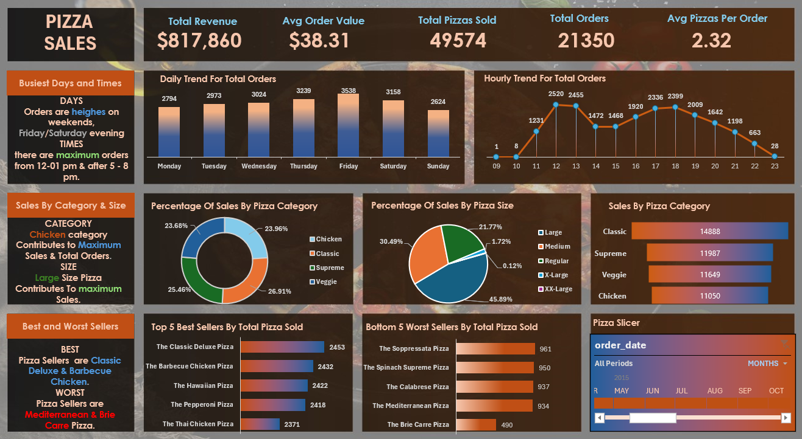

# Pizza Sales Analysis  

## 📊 Project Overview  
This project analyzes pizza sales data to uncover actionable business insights. Using a combination of data querying and visualization techniques, it highlights sales trends, top-performing products, and customer behavior patterns. The analysis is presented in a visually engaging dashboard that simplifies decision-making for stakeholders.  

---

## 🛠️ Features  
- **Key Performance Indicators (KPIs):**  
  - Total Revenue: $817,860  
  - Average Order Value: $38.31  
  - Total Pizzas Sold: 49,574  

- **Sales Insights:**  
  - Most popular category: **Chicken pizzas**  
  - Highest revenue contribution by size: **Large pizzas**  
  - Top seller: **Classic Deluxe Pizza**  
  - Least popular: **Brie Carre Pizza**  

- **Trend Analysis:**  
  - Busiest times: Weekends (Friday/Saturday), especially 12–1 PM & 5–8 PM.  
  - Hourly and daily order trends to optimize operational efficiency.  

---

## 🚀 Technologies Used  
- **SQL**: For data extraction and querying.  
- **Data Visualization Tool**: Power BI (or Tableau, Excel) for creating the dashboard.  
- **Dataset**: Pizza sales data (fictional/business dataset).  

---

## 📂 File Structure  
- **Dashboard Image**: `Pizza Sales.png` - A snapshot of the interactive dashboard.  
- **SQL Queries**: `PIZZA SALES SQL QUERIES.docx` - Contains the SQL queries used for the analysis.  

---

## 🔍 Insights Summary  
- **Chicken pizzas** lead sales by category.  
- Large pizzas are the preferred size, contributing 45.89% of total sales.  
- The busiest times for orders are **lunch (12–1 PM)** and **dinner (5–8 PM)**.  
- Optimizing inventory and staffing during these times could maximize profitability.  

---

## 📈 Dashboard Preview  
  
The dashboard provides an intuitive summary of the sales performance, highlighting key trends and insights.

---

## 🤝 Contributing  
Contributions are welcome! Feel free to fork the repository and submit a pull request with improvements or additional features.  

---

## 📬 Contact  
For any questions or feedback, reach out to me on [LinkedIn](www.linkedin.com/in/sayedesmail) or email me at **esmailsayed124@gmail.com**.
